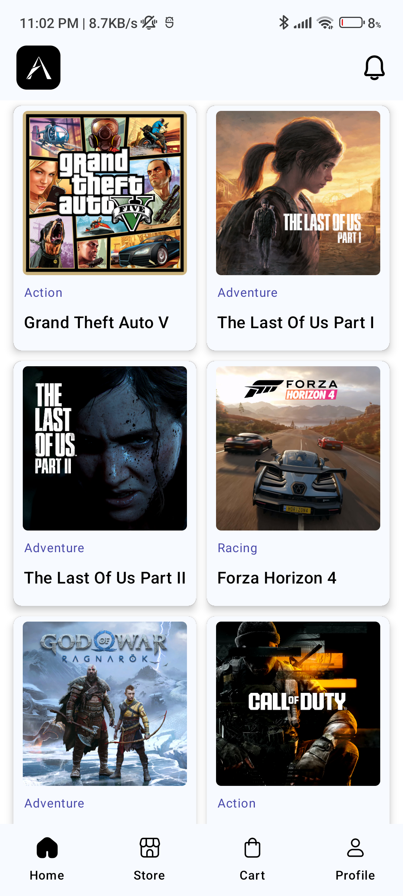
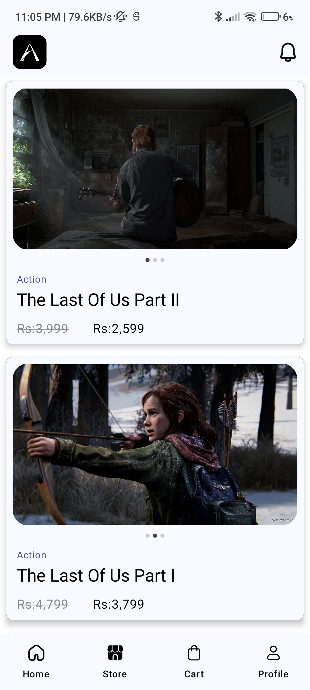
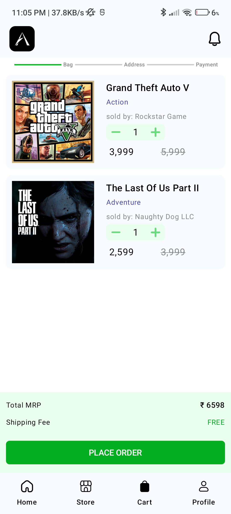
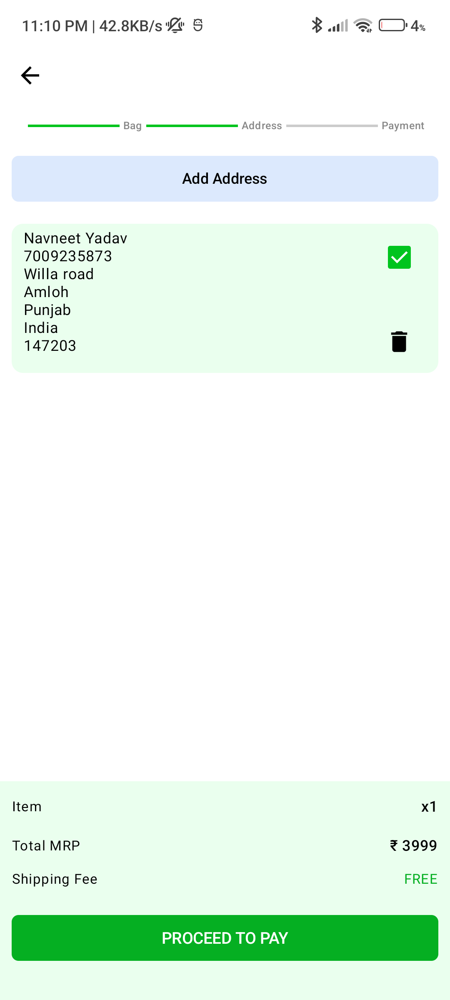
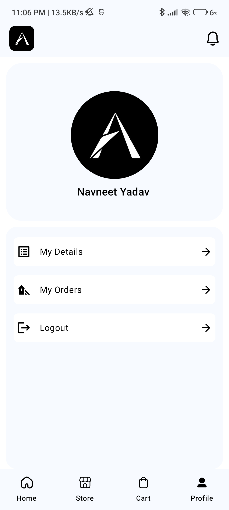

  
  <h3 align="center">GAMES SHOPPING APP ARENA</h3>

An E-Commere Shopping App selling pc-console games

  Shop Arena is an Android application designed to provide a seamless shopping experience for video game enthusiasts. Users can browse a wide selection of games, add them to their cart, and proceed with their transactions

## Screenshots

  
  
  
  
  
  

[//]: # (<a href="https://drive.google.com/file/d/1fFaSRDJ0lcOTYglQCBpepjVlQXGehy5E/view?usp=sharing" > Download My App</a>)

## Tools and Libraries Used

- Language: Kotlin
- Framework: Android Jetpack Compose
- Image Loading: Glide
- Asynchronous Programming: Coroutines, Kotlin Flows
- Android Architecture Components: ViewModel
- Backend: Firebase
- Auth: Firebase Auth( OTP or Password)

  
  
  
  
  

## Setup and Installation

1. Clone the repository: `git clone https://github.com/Navneet851/E-Commerce-Arena.git`
2. Build and run the project on an emulator or actual device

## Contributing

Pull requests are welcome. For major changes, please open an issue first to discuss what you would like to change.# E-Commerce-compose